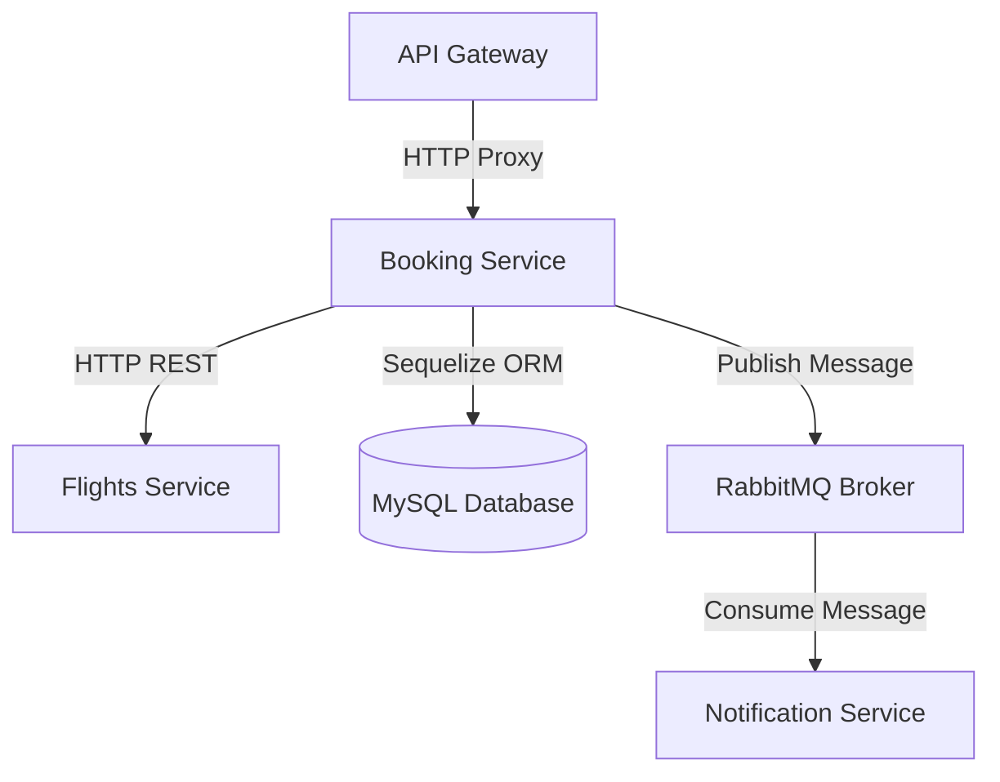
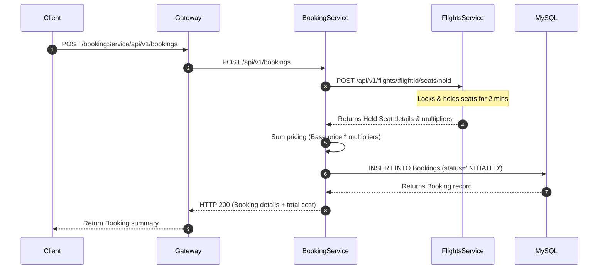
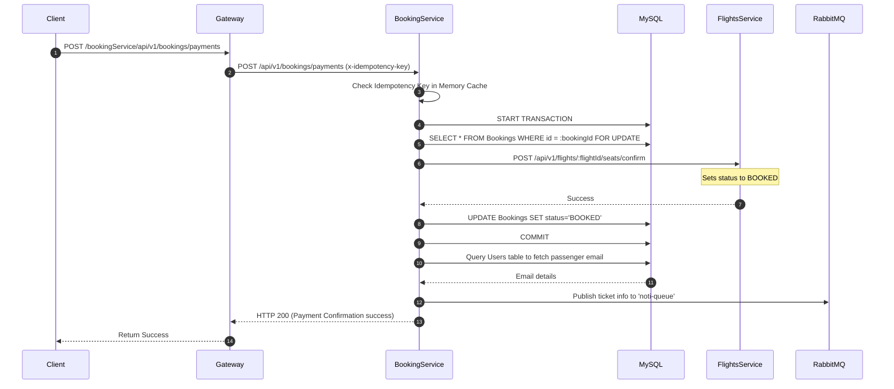
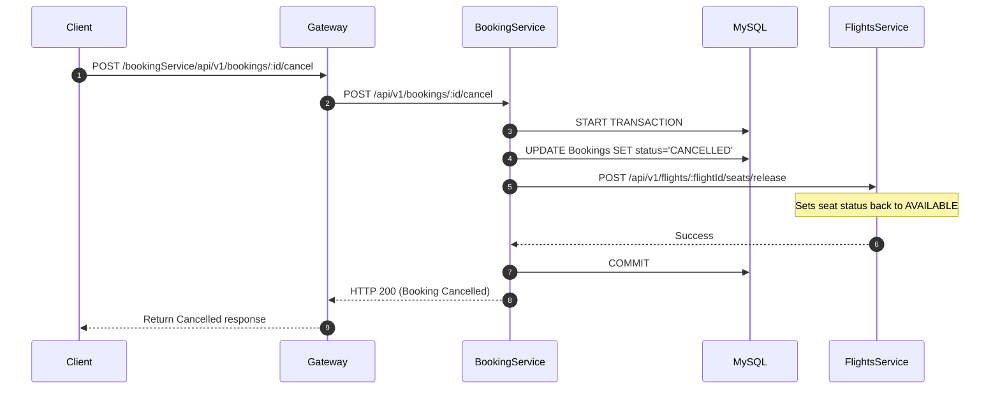
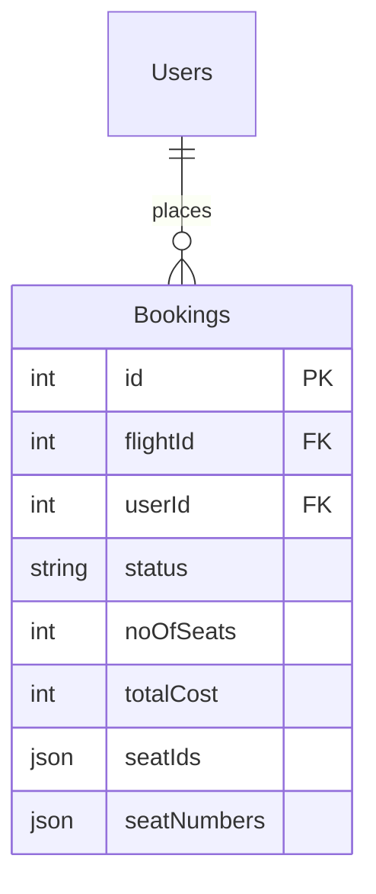

# Booking Service

## 1. Service Overview
The **Booking Service** orchestrates the ticket purchasing workflows, pricing calculations, payment validations, and reservation state modifications inside the Booking Mafia ecosystem.

### Business Responsibilities
- **Booking Creation**: Initiating ticket requests by communicating with Flights Service to verify and hold target cabin seats.
- **Dynamic Pricing Calculator**: Querying seat multipliers to sum total fares dynamically.
- **Payment Processing & Idempotency Check**: Executing checkouts against transaction reference keys to prevent double billing.
- **Queue Dispatching**: Emitting ticket records to RabbitMQ (`noti-queue`) once confirmation transactions commit successfully.
- **Self-Expiration Job**: Releasing reserved seats automatically if payment is not received within 5 minutes.

---

## 2. Folder Structure
```
Flights-Booking-Services/
├── src/
│   ├── config/             # Environment, queue, and DB settings
│   ├── controllers/        # Booking & payments controller handlers
│   ├── migrations/         # Sequelize DDL schemas (Bookings schema)
│   ├── models/             # Booking ORM definitions
│   ├── repositories/       # Core database queries (CRUD/booking patterns)
│   ├── routes/             # Route configurations
│   ├── services/           # Business domain rules (payment flow)
│   └── utils/
│       ├── common/         # Enums, responses
│       └── errors/         # Custom AppErrors definitions
```
### Folder Responsibilities
- **`controllers/booking-controller.js`**: Handles requests for holds, checkout payments, booking details, and user-initiated cancellations.
- **`services/booking-service.js`**: Drives the core payment logic, verifies user records, calls external flights seat updates, and queues notification tickets.
- **`repositories/booking-repository.js`**: Interacts with the `Bookings` MySQL database schema.

---

## 3. Architecture Diagram


---

## 4. Sequence Diagrams

### Create Booking


### Payment Success


### Payment Failure / Booking Cancellation


---

## 5. API Documentation

### POST /api/v1/bookings
- **Description**: Hold seats and create a pending booking.
- **Authentication**: JWT Required
- **Request Body**:
  ```json
  {
    "flightId": 5,
    "userId": 1,
    "seatNumbers": ["12A", "12B"]
  }
  ```
- **Success Response (200)**:
  ```json
  {
    "success": true,
    "message": "Successfully created booking",
    "data": {
      "id": 48,
      "flightId": 5,
      "userId": 1,
      "status": "INITIATED",
      "noOfSeats": 2,
      "totalCost": 550,
      "seatNumbers": ["12A", "12B"]
    }
  }
  ```

### POST /api/v1/bookings/payments
- **Description**: Validate and complete ticket invoice payments.
- **Authentication**: JWT Required
- **Headers**:
  - `x-idempotency-key`: Unique string identifier
- **Request Body**:
  ```json
  {
    "bookingId": 48,
    "userId": 1,
    "totalCost": 550
  }
  ```
- **Success Response (200)**:
  ```json
  {
    "success": true,
    "message": "Successfully completed payment transaction",
    "data": true
  }
  ```

---

## 6. Database Schema

### Database Tables
- **Bookings**: Tracks reservation states.
  - `status`: ENUM (`INITIATED`, `PENDING`, `BOOKED`, `CANCELLED`).
  - `seatIds`: Array of database seat identifiers.
  - `seatNumbers`: Array of physical seat labels (e.g., `["12A", "12B"]`).

---

## 7. Service Communication
- **REST calls**:
  - `POST http://flight-service/api/v1/flights/:id/seats/hold`
  - `POST http://flight-service/api/v1/flights/:id/seats/confirm`
  - `POST http://flight-service/api/v1/flights/:id/seats/release`
- **RabbitMQ events**:
  - Publishes ticket notification payloads containing flight reference, booking ID, seat numbers, and user email to `noti-queue`.

---

## 8. Docker Documentation
- **Build Command**:
  ```bash
  docker build -t bookingmafia/booking-service:latest .
  ```
- **Ports**: Exposes port `4000`.
- **Environment Variables**:
  - `PORT=4000`
  - `DB_HOST=mysql-db`
  - `FLIGHT_SERVICE=http://flights-service:3000`
  - `RABBITMQ_URL=amqp://rabbitmq-broker:5672`

---

## 9. Kubernetes Documentation
- **Deployment**: Deploys stateless pods that manage user bookings logic.
- **Service**: Exposes port `4000` internally.
- **ConfigMap / Secrets**: Supplies API connections and RabbitMQ tokens.

---

## 10. Environment Variables
See `.env.example`:
```ini
PORT=4000
DB_HOST=127.0.0.1
DB_USER=root
DB_PASS=password
DB_NAME=Flights
FLIGHT_SERVICE=http://localhost:3000
RABBITMQ_URL=amqp://localhost
```

---

## 11. Error Handling Strategy
- **Payment Conflict**: Enforces a memory cache map checking for transaction retry attempts on a completed key.
- **REST Failures**: Automatically catches failures from the Flights Service and rollbacks database changes if seats cannot be locked.

---

## 12. Logging Strategy
- Logs incoming payment transaction metadata.
- Emits warnings on RabbitMQ broker communication connection failures.

---

## 13. Scaling Strategy
- Booking operations are memory lightweight and horizontally scalable using simple CPU thresholds.
- Integrates asynchronous RabbitMQ messaging for heavy operations like sending emails.

---

## 14. Security
- Idempotency key safeguards ensure users are not charged twice under browser click retries.
- Sanitizes incoming payload values dynamically.

---

## 15. Future Improvements
- **Saga Orchestrator**: Implement a Saga Pattern orchestrator to maintain atomic consistency across Flights and Booking databases safely without tight HTTP couplings.
- **Distributed Cache Locks**: Replace in-memory idempotency caches with a shared Redis cluster database.
